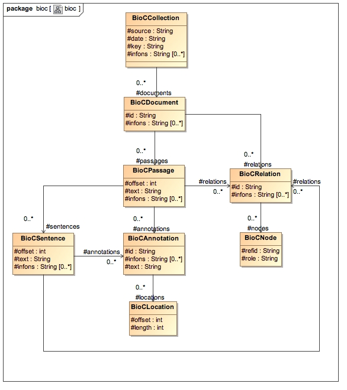

# UimaBioC

This project provides code that permits the use BioC structures as a UIMA type and provide support for it's use in text mining applications based on the CleartTk UIMA system. Note that our processing uses *either* BioC data formatted as XML or as JSON (and most of our applications use 

## The BioC Data Model



This diagram shows the relationship between the various elements. Note that annotations are primarily structured using `infons` key-value tables, which are themselves unspecified. Using this library to extract data from `*.nxml` files generates BioC formatted data with a predefined organization based on [`edu.isi.bmkeg.uimaBioC.uima.readers.Nxml2TxtFilesCollectionReader`](src/main/java/edu/isi/bmkeg/uimaBioC/uima/readers/Nxml2TxtFilesCollectionReader.java). 

* The document has an infons object describing it's metadata:

```
  {'"pmc": "2191828",  
  "pmid": "7528775", 
  "publisher-id": "95105720", 
  "relative-source-path": "7528775.txt", 
  "type": "formatting", 
  "value": "article-id"}
```

* We add a single passage containing all available text to the document with an infons object: `{'type':'document'}`. All annotations can then be attached to this passage.
* We use annotations with an infons object `{'type':'formatting', 'value': '???'}` where the value field could be `front`, `abstract`, `body` or `ref-list` to denote those parts of the text. 
* Similarly, we use annotations with an infons object `{'type':'formatting', 'value': '???'}` where the value field could be `title`, `subtitle`, `sec`, `p`,  `caption` or `fig` to denote those parts of the text.
* The same is true for the following simple text formating elements: `bold`, `italic`, `sub`, `sup`.
* Note that each `BioCAnnotation` has a `BioCLocation` with a `length` and `offset` value that embeds it into the body of the text as a whole.  

Other indexing processes use infons to construct BioC annotations for other elements (PDF annotations, Named entities, etc). This UIMA library provides access to UIMA-based computation for this effort by providing pipelines with collection readers that read BioC-formatted (and libaries that execute on BioC-formatted data).  

## Additional BioC Processing Libraries

* [Core Java Code Cloned from Sourceforge site](https://github.com/openbiocuration/BioC_Java)
* [Python library](https://github.com/2mh/PyBioC)

